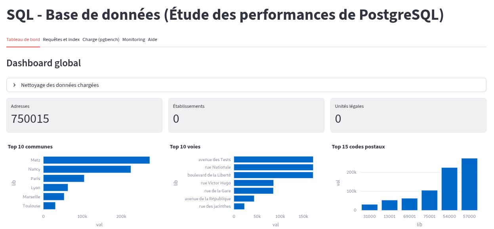

Application streamlit (python) et scripts pour installer un environnement postgresql, charger des données, visualiser des statistiques et réaliser des benchmarks (pgbench).

## Présentation
Ce projet propose:
- une **application streamlit** de visualisation et d'expérimentation autour des **performances postgresql**,
- un script Bash interactif pour installer/configurer postgresql (cluster dédié), restaurer des sauvegardes et lancer l'application.

## Fonctionnalités
- **Tableau de bord**: métriques et graphiques (barres, lignes, aires), comparatif avec/sans index.
- **Requêtes et index**: exécution libre, création d'index utiles, mini-benchmarks avant/après index.
- **Charge (pgbench)**: exécution simple et campagnes multi-clients par profil (impact hardware/tuning), export CSV.
- **Monitoring**: vues v_index_usage et v_table_stats pour suivre l'utilisation des index et la taille des tables.
- **Chargement de données**: scripts intégrés pour structure minimale et jeux de données de différentes tailles.

## Prérequis
- Linux (Debian/Ubuntu) avec sudo pour le script d'installation.
- Python 3.9+, python3-pip, python3-venv, git
- Postgresql (13, 15..)

## Installation rapide (script Bash)
1.  Clonez ce dépôt en utilisant la commande suivante :
```
git clone https://github.com/anis-metref/postgresql-perf.git
cd postgresql-perf
```
Le script gère l'installation PostgreSQL, la création d'un cluster dédié, la configuration réseau locale 

1) Exécuter le script avec droits root:
```
chmod +x ./setup_env.sh
sudo ./setup_env.sh
```
2) Dans le menu:
- 1 ) Installer PostgreSQL et créer cluster
- 5 ) Créer la base tp3Perf
- 6 ) Bootstrap SQL (structure minimale)
- 7 ) Charger données d'exemple OU 8) Charger données conséquentes OU "Données moyen volume" depuis l'app
- 12 ) Lancer l'application Streamlit

## Lancer l'application (manuel)
Sans passer par le script Bash:
```
python3 -m venv venv
source venv/bin/activate
pip install -r requirements.txt
streamlit run main.py
```

- Acceder depuis le navigateur : http://votreip:8501 
- Puis configurer la connexion postgresql dans la barre latérale de l'app.

## Données sql
Scripts intégrés (barre latérale de l'app):
- Structure minimale: /sql/bootstrap.sql
- Données d'exemple: /sql/sample_data.sql
- Données moyen volume (~50k): /sql/data_moyen.sql
- Données conséquentes (~300k): /sql/data.sql
- Vous pouvez aussi charger un script .sql personnalisé (uploader dans la barre latérale).

Conseil:
- Commencez avec data_moyen.sql pour des démos rapides.
- Utilisez la section "Nettoyage des données" (onglet Tableau de bord) pour vider les tables et recharger une autre data plus volumineuse "big_data.sql".

## Benchmarks et monitoring
- Onglet "**Requêtes et index**":
  - Benchmarks avant/après index sur 2 requêtes typiques (égalité texte, lat/lon) avec tableau et graphes comparatifs.
- Onglet "Charge (pgbench)":
  - Exécution simple: affiche la commande, la sortie, et alimente les graphes TPS/latence.
  - Campagne multi-clients par profil (ex: "2GB RAM, tuning A"): table de résultats, courbes TPS/latence, barres comparatives par profil, export CSV.
- Onglet "Monitoring":
  - Visualisation des vues v_index_usage et v_table_stats.

## Nettoyage des données
Onglet "**Tableau de bord**": section "Nettoyage des données":
- Liste des tables visées (referentiels.adresse_postale, referentiels.etablissement, referentiels.unite_legale) et volumes actuels.
- Bouton pour TRUNCATE ... RESTART IDENTITY sur ces tables, puis recharger un autre .sql.

## Dépannage
- Authentification PostgreSQL:
  - Il n'y a pas de mot de passe par défaut pour l'utilisateur postgres. En local, vous pouvez définir un mot de passe:
    ```sql
    sudo -u postgres psql
    ALTER USER postgres PASSWORD 'VotreMotDePasseSolide';
    ```
  - Dans l'app, utilisez l'hôte 127.0.0.1 (évite IPv6 ::1 si pg_hba.conf n'est pas configuré) et renseignez le mot de passe.
- Vues de monitoring: si vous voyez "cannot drop columns from view", rejouez le bootstrap (les scripts suppriment désormais les vues puis les recréent):
  ```
  sudo -u postgres psql -d tp3Perf -f projet/sql/bootstrap.sql
  ```
- pgbench absent:
  - Installez postgresql-client et postgresql-contrib via le menu 1) ou apt:
    ```
    sudo apt-get install -y postgresql-client postgresql-contrib
    ```
- Service/cluster:
  - Vérifiez l'état via le menu 11) du setup ou:
    ```
    sudo pg_lsclusters
    sudo systemctl status postgresql@<version>-<cluster>
    ```

## Structure du dépôt
- main.py: application Streamlit
- setup_env.sh: script d'installation/gestion avec menu
- sql/*.sql: scripts SQL intégrés (structure, données)
- requirements.txt: dépendances Python

